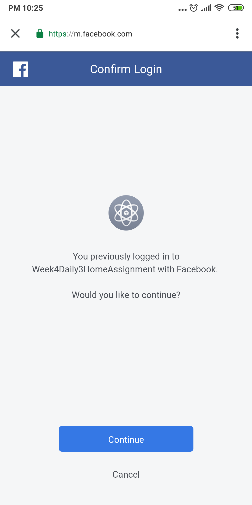
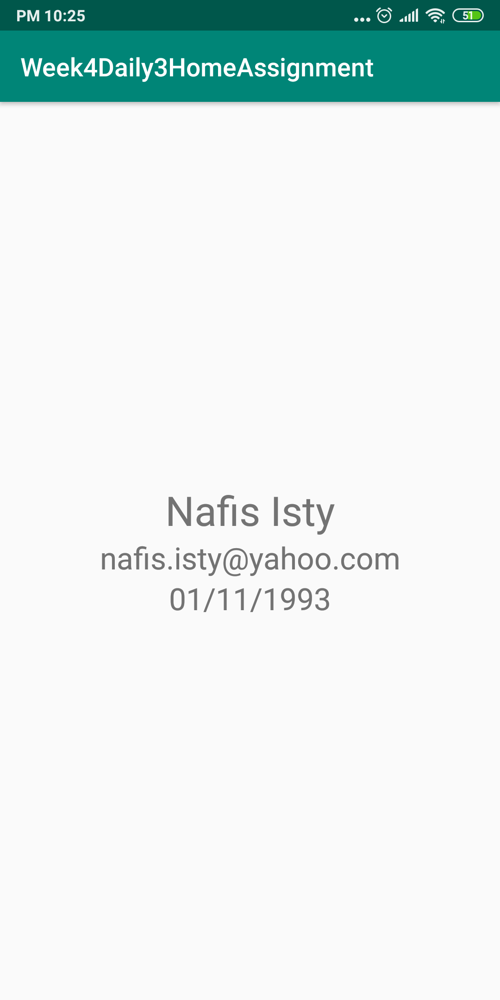

# Week4Daily3HomeAssignment
Simple Android application with login using firebase and facebook. Also displaying and updating user information features base on login type. In coding, mvp has been followed.

Login Page. At first, going for the firebase login.

Successfully logged in and retrieve user information.

Changed the user info.

Saving the changed value and showing in another activity.

Now, its time to login with facebook.

As, I have already logged in earlier, it hasn't ask for email & pass for me. But it will ask for email & password for first time.

Successfully logged in using facebook. Showing facebook user inforamtion which is different from the firebase user.

